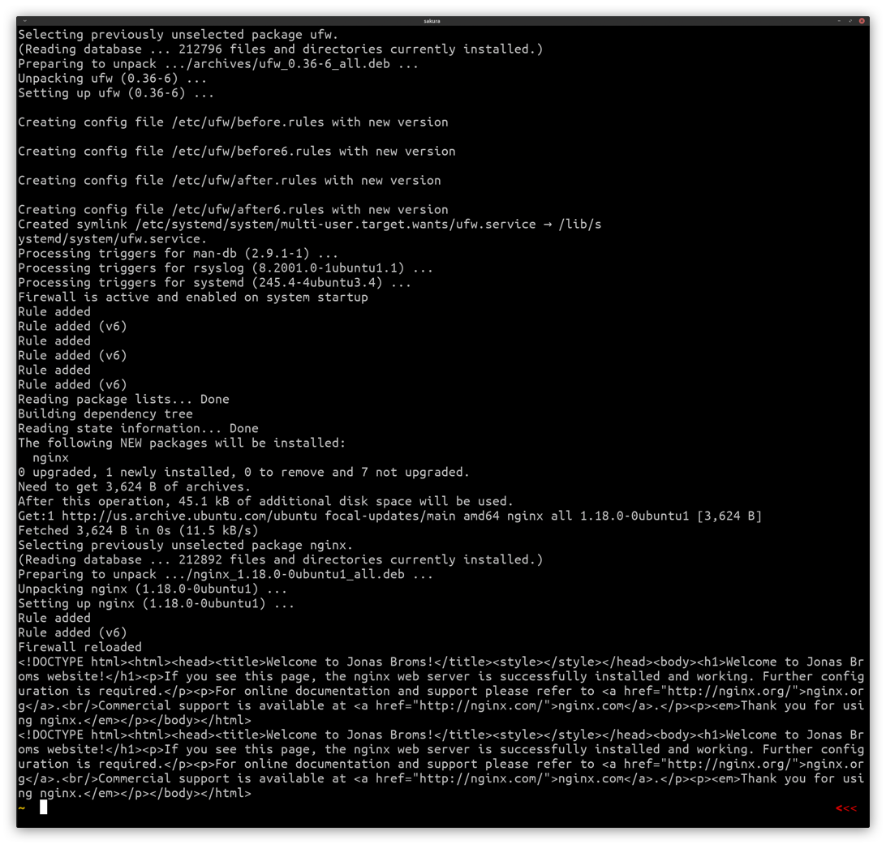
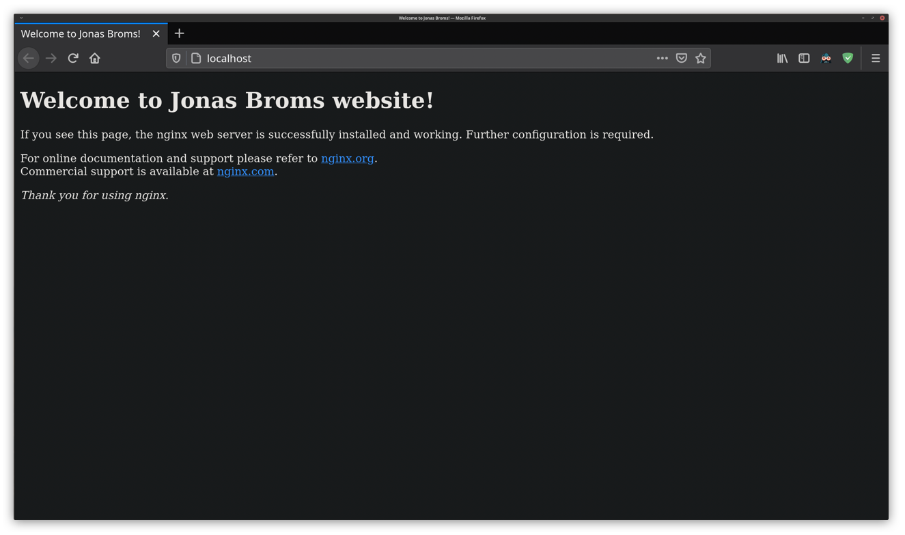

# Linux Assignment #2

1. The script can be found by [clicking here](../../scripts/assignments/linuxa2.sh). After downloading the script, please make sure that it is executable in the location you've put it in by typing: `chmod +x linux2.sh`.
   You can read the entire script below:

   ```bash
   #!/bin/bash

   # testing so that the script is run by either root user or sudo
   if [ $(whoami) != root ]; then
   	echo "You are running as $(whoami). Please run this script as root or sudo"
   	exit
   fi

   # update the package manager
   sudo apt update -y

   # install a firewall
   sudo apt install ufw -y

   # enables the firewall
   sudo ufw enable

   # limit amount of ssh connection to the default no. of 6
   sudo ufw limit ssh

   # allowing OpenSSH to connect to this node
   sudo ufw allow OpenSSH

   # allowing port 80 & tcp connections
   sudo ufw allow 80/tcp

   # installing webserver: nginx
   sudo apt install nginx -y

   # allowing the webserver thru the firewall
   sudo ufw allow 'Nginx Full'

   # reloading the firewall so that all the newly applied rules have come to full effect
   sudo ufw reload

   # creating the users own website by overwritig the NGINX default website
   echo '<!DOCTYPE html><html><head><title>Welcome to Jonas Broms!</title><style></style></head><body><h1>Welcome to Jonas Broms website!</h1><p>If you see this page, the nginx web server is successfully installed and working. Further configuration is required.</p><p>For online documentation and support please refer to <a href="http://nginx.org/">nginx.org</a>.<br/>Commercial support is available at <a href="http://nginx.com/">nginx.com</a>.</p><p><em>Thank you for using nginx.</em></p></body></html>' | sudo tee /var/www/html/index.nginx-debian.html

   # as a precaution, creting a backup of the default configuration for nginx, for the future this should probably be changed from old to a timestamp naming convention
   sudo cp /etc/nginx/nginx.conf /etc/nginx/old.nginx.conf

   # starting the webserver
   sudo systemctl start nginx

   # testing that the website is working
   curl localhost

   ```

   The output should look something like this in the terminal window & we browser:
   
   

---

Sources:

- [Jason Rigden - How to host a static website](https://medium.com/@jasonrigden/how-to-host-a-static-website-with-nginx-8b2dd0c5b301)
